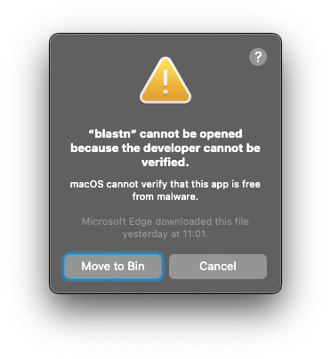
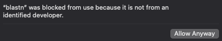

# Doing BLAST on your local computer

BLAST: Compare & identify sequences

## Basic sequence format - FASTA

A fasta file is **Text file** begins with a single-line description, followed by lines of sequence data.

Introducing `.fasta`/`.fa`

```
>DNA_Sequence_ID_1
ATCGCCGGTGACGTCTGCGTC
>DNA_Sequence_ID_2
TGGGCTAGCTAGTTATCTCCGCGCGGAAT
AGCTCTATTGTGTGTATTATAT
>DNA_Sequence_ID_3
TCGATCTCTTCTTATATATGCGCGGATCTAGGCTATATTCGATCGTAGCTA
```

```
>Prot_Sequence_ID
VAETLKKGSRVTGAARDKLAADLKKKYDAGASIRALAEETGRSYGFVHRMLSESGVTLRG
RGGATRGKKATSA*
```

:::{NOTE}
1. Sequence data is always connected, nither 'space' nor 'line break' creates gap.
2. One or more sequence can be in one file
3. ID can contain 'space', but not 'line break'
4. Protein may contain '*' representing stop codon, but not necessarily
:::

Variants of file extensions:

- `.fna` fasta for Nucleotide (DNA and RNA)
- `.frn` fasta for RNA (RNA coding)
- `.faa` fasta for protein (Amino acid)
- `.ffn` fasta for protein coding DNA

## How BLAST works

- Which program
  - blastn
    - Query: nucleic acid sequence(s)
    - Database: nucleic acid sequences
  - blastp
    - Query: amino acid sequence(s)
    - Database: amino acid sequences
  - blastx
    - Query: nucleic acid sequence(s)
    - Automatically translate **query** to amino acid sequences (all frames)
    - Database: amino acid sequences
  - tblastn
    - Query: amino acid sequence(s)
    - Database: nucleic acid sequences
    - Automatically translate **database** to amino acid sequences (all frames)
  - tblastx
    - Query: nucleic acid sequence(s)
    - Automatically translate **query** to amino acid sequences (all frames)
    - Database: nucleic acid sequences
    - Automatically translate **database** to amino acid sequences (all frames)
- Query
  - A fasta file/text (one or multiple sequences)
- Database
  - RefSeq? Non-redudant? WGS?
  - Local
    - One genome
    - One proteome
    - Manual combination of sequences
- Parameters
  - Number of max targets
  - Expect (*e-value*)
  - Word size (length of intial exact match)
  - Output/Download format
  - ...

## Setup command line BLAST tool set

:::{NOTE}
You do NOT have `blast` command!  
Commands avaliable: `blastn`, `blastp`, `blastx`, `tblastn`, `tblastx`, `makeblastdb` etc.
:::

### Setup Windows machine in bash environment (git for windows)

1. Install [https://gitforwindows.org/](https://gitforwindows.org/) first, you get access to `tar` command.
2. Download portable blast from NCBI:
   - [https://blast.ncbi.nlm.nih.gov/Blast.cgi](https://blast.ncbi.nlm.nih.gov/Blast.cgi) -> Download BLAST
   - ftp://ftp.ncbi.nlm.nih.gov/blast/executables/blast+/LATEST/ -> ncbi-blast-2.13.0+-x64-win64.tar.gz
3. Open 'Git Bash', change directory to the download files, do `tar xzf ncbi-blast-2.13.0+-x64-win64.tar.gz`
   - Equivalent to `tar -x -z -f ncbi-blast-2.13.0+-x64-win64.tar.gz`
   - `-x` To unpack the package (`.tar`)
   - `-z` Tells the program that this is a compressed package and the compression format is "gzip" (`.gz`)
   - `-f [file]` Specify the file to operate.
4. Copy everything from `ncbi-blast-2.13.0+/bin` to `/usr/bin` directory.

```shell
$ cd /c/User/[name]/Downloads/
$ ls
ncbi-blast-2.13.0+-x64-win64.tar.gz
ncbi-blast-2.13.0+/
$ cp /c/User/[name]/Downloads/ncbi-blast-2.13.0+/bin/* /usr/bin/
$ blastn -h
USAGE
  blastn [-h] [-help] [-import_search_strategy filename]
    [-export_search_strategy filename] [-task task_name] [-db database_name]
    ...
```

### Setup BLAST on MacOS/Linux

#### Solution 1

Download the program and put it in your environment variables.

1. Download portable blast from NCBI:
   - [https://blast.ncbi.nlm.nih.gov/Blast.cgi](https://blast.ncbi.nlm.nih.gov/Blast.cgi) -> Download BLAST
   - ftp://ftp.ncbi.nlm.nih.gov/blast/executables/blast+/LATEST/ 
   - ncbi-blast-2.13.0+-x64-macosx.tar.gz 
   - ncbi-blast-2.13.0+-x64-linux.tar.gz
2. Open terminal, change directory to download folder, do `tar xzf ncbi-blast-2.13.0+-x64-win64.tar.gz`
   - Equivalent to `tar -x -z -f ncbi-blast-2.13.0+-x64-win64.tar.gz`
   - `-x` To unpack the package (`.tar`)
   - `-z` Tells the program that this is a compressed package and the compression format is "gzip" (`.gz`)
   - `-f [file]` Specify the file to operate.
3. Put the directory `ncbi-blast-2.13.0+` in a location you can remember, eg. at your home directory `~`:

   ```shell
   # In this example, we will put blast directory
   # "ncbi-blast-2.13.0+" in your home directory "~"
   $ cp -r ~/Downloads/ncbi-blast-2.13.0+ ~/
   $ ls ~/
   ncbi-blast-2.13.0+/
   $ ls -l ~/ncbi-blast-2.13.0+/
   total 72
   -rw-r--r--@  1 bob  staff     85 Feb 23  2022 ChangeLog
   -rw-r--r--@  1 bob  staff   1055 Feb 23  2022 LICENSE
   -rw-r--r--@  1 bob  staff    465 Feb 23  2022 README
   drwxr-xr-x@ 30 bob  staff    960 Feb 23  2022 bin
   drwxr-xr-x@  4 bob  staff    128 Mar  7  2022 doc
   -rw-r--r--@  1 bob  staff  23845 Feb 23  2022 ncbi_package_info
   # Note: double check the spell! The special charaters are
   # important in this export command.
   # If you did not put ncbi-blast-2.13.0+ folder as the example
   # above, pleaase change the full path!
   $ BLAST_BIN_FULL_PATH=~/ncbi-blast-2.13.0+/bin/
   ```

4. Now we need to tell bash that the `bin` directory is where we stored some program, so that when we want to use `blastn` etc, bash can find them. To do this, we need to add the full path to this directory to an environment variable called "PATH".

   ```shell
   # 1. Let's check current environment variable PATH
   $ echo $PATH
   /usr/local/bin:/usr/bin:/bin:/usr/sbin:/sbin
   # 2. Put full ncbi bin path to the front of it
   $ export PATH="$BLAST_BIN_FULL_PATH:$PATH"
   # 3. Check if your export command succeeded
   $ echo $PATH
   /usr/home/bob/ncbi-blast-2.13.0+/bin:/usr/local/bin:/usr/bin:/bin:/usr/sbin:/sbin
   # Note the full path of ncbi-blast-2.13.0+/bin is now the
   # first item splited by colon ":"
   ```
   
   :::{NOTE}
   You have to run the export command `export PATH="~/ncbi-blast-2.13.0+/bin/:$PATH"` after every restart of your termial. If you want it to be permenent, you can put this command in a file that will be run everytime when your shell starts:
   
   ```shell
   # FOR
   # MacOS default shell is zsh
   SHELL_CONFIG_FILE=~/.zshrc
   # All other systems using bash
   SHELL_CONFIG_FILE=~/.bashrc

   # Put the export command 
   echo 'export PATH="~/ncbi-blast-2.13.0+/bin/:$PATH"' >> $SHELL_CONFIG_FILE
   ```

   For MacOS only, the downloaded `blastn`, `blastp` ... programs are treated as dangerous programs which MacOS will prevent it to run. If you got this notification while running any blast program eg. `blastn -h`:
   
   

   Please click "Cancel", then go to your "System Settings" -> "Privacy & Security" -> Tab "Security". You will see somthing like:

   
  
   Then you can click "Allow Anyway" and follow instructions to free our blast program from jail. (Keep "System Settings" open, you will need it again for all blast programs) Now you may try the program again eg. `blastn -h`, you will see another warning message:

   

   :::
   
#### Solution 2

Use a package manager.

##### Linux

Need **sudo** right.

Ubuntu and other Debian based system:

```shell
sudo apt install ncbi-blast+
```

Centos or other RedHat based system:

Download `ncbi-blast-2.13.0-1.x86_64.rpm` from  
ftp://ftp.ncbi.nlm.nih.gov/blast/executables/blast+/LATEST/ 

```shell
sudo dnf install ~/Downloads/ncbi-blast-2.13.0-1.x86_64.rpm
```

! not tested, but should work across platforms and do not need sudo right.

```shell
pkcon install ncbi-blast+
```

##### MacOS

Install [homebrew](https://brew.sh/) (need **sudo** right)

```shell
/bin/bash -c "$(curl -fsSL https://raw.githubusercontent.com/Homebrew/install/HEAD/install.sh)"
```

Then install BLAST, you do not need sudo right anymore.

```shell
brew install blast
```

### Setup BLAST using conda/micromamba

Check how to install conda (micromamba) [here](micromamba.md).

```shell
conda activate
# this will activate
conda install blast -c bioconda
```

## Run your first BLAST job locally

### Make a database

Obtain sequences you want to target.

1. Search an organism on NCBI, download its assembly
   - Genome / CDS / Proteins / RNA ...
2. Search a term on NCBI, download all matching sequences
   - Protein and Nucleotide sequences
   - Note "Gene" is information, "Nucleotide" is the sequence you want
3. Search a term on UniProt, download all matching sequences
4. "Write" a text fasta file by yourself
   - Make it up
   - Combine some of your downloaded sequences

:::{TIP}
"Protein" and "Translated CDS" are different. "Protein" has higher certainty as predicted that they can be translated into real proteins.  
"Gene" is information, "Nucleotide" is the sequence you want.
:::

#### Example

Download predicted proteome of *Streptomyces coelicolor* A3(2) from NCBI RefSeq database, make a BLAST database containing all possible proteins.

1. Go to [https://www.ncbi.nlm.nih.gov/](https://www.ncbi.nlm.nih.gov), search "Streptomyces coelicolor" in the search box.
2. Scroll down, in the "Genomes" box, click "Assembly".
3. In the left column, untick "Latest", tick "Latest RefSeq" and "Complete genome"
4. From the search results (middle column), you need to find "Organism: Streptomyces coelicolor A3(2)" as this is the model strain of this organism. Click on the accession link.
5. Upper right corner, you can find "Download Assembly" button, click on it, choose "RefSeq" as "Source database" and choose "Protein FASTA (.faa)" as "File type". The "Estimated size" should **not** show "0". Then click the "Download" button.
6. You have downloaded a file "genome_assemblies_prot_fasta.tar", which is a "tar ball". A "tar ball" is simply a package of files.
7. Go to your terminal, navigate to the "Downloads" folder containing this file, extract the package by running `tar` command:

   ```shell
   $ cd ~/Downloads
   $ ls
   genome_assemblies_prot_fasta.tar
   $ tar xf genome_assemblies_prot_fasta.tar
   $ ls
   genome_assemblies_prot_fasta.tar   ncbi-genomes-2022-12-09/
   $ cd ncbi-genome-2022-12-09
   $ ls
   GCF_008931305.1_ASM893130v1_protein.faa.gz    README.txt    md5checksums.txt
   ```

8. Note the file `GCF_008931305.1_ASM893130v1_protein.faa.gz`, it is your downloaded protein sequences (`.faa`) but it has an extra extension `.gz` meaning it is "**g** zipped". Before we can use it, we need to **unzip**:

   ```shell
   $ gzip -d GCF_008931305.1_ASM893130v1_protein.faa.gz
   # -d tells the program to "decompress", ie. unzip.
   $ ls
   GCF_008931305.1_ASM893130v1_protein.faa    README.txt    md5checksums.txt
   ```

   Note that the `.gz` extension has gone.
9. Make database use `makeblastdb` command:

   ```shell
   $ makeblastdb -in GCF_008931305.1_ASM893130v1_protein.faa.gz -dbtype prot

   Building a new DB, current time: 13/09/2022 10:50:56
   New DB name:   /Users/bob/Downloads/ncbi-genomes-2022-12-09/GCF_008931305.1_ASM893130v1_protein.faa
   New DB title:  GCF_008931305.1_ASM893130v1_protein.faa
   Sequence type: Protein
   Keep MBits: T
   Maximum file size: 3000000000B
   Adding sequences from FASTA; added 7511 sequences in 0.157292 seconds.

   $ ls
   GCF_008931305.1_ASM893130v1_protein.faa
   GCF_008931305.1_ASM893130v1_protein.faa.pjs
   GCF_008931305.1_ASM893130v1_protein.faa.pto
   GCF_008931305.1_ASM893130v1_protein.faa.pdb
   GCF_008931305.1_ASM893130v1_protein.faa.pot
   GCF_008931305.1_ASM893130v1_protein.faa.phr
   GCF_008931305.1_ASM893130v1_protein.faa.psq
   GCF_008931305.1_ASM893130v1_protein.faa.pin
   GCF_008931305.1_ASM893130v1_protein.faa.ptf
   README.txt
   md5checksums.txt
   ```
   
   Note your database is made by generating many files with different extension, all of these files are needed for a complete blast database.

:::{IMPORTANT} Which is "the database"?
Usually when you are telling BLAST programs to do a search, you will need an argument specifying the path to your database, and you can only give **one**. But with this many files/paths, which one should we use?

! Your database is the **common** part of all generated files, which is essentially `GCF_008931305.1_ASM893130v1_protein.faa` in this example
:::

### Make a query file

Note you need to make a [FASTA file](#basic-sequence-format---fasta). Use a pure text editor (those you can not set format for your text) or switch your text editor to "plain text mode". You can copy and paste multiple sequences (with FASTA header line) into a single file. Or, if you remember `cat` command, you can generate a single query file containing multiple sequences by:

```shell
# Assuming you have the sequences of two proteins downloaded as fasta file:
cat protein_A.faa protein_B.faa > proteins.faa
```

To follow the example above, let's make a protein file directly from command line:

```shell
$ echo ">protein_A
VAETLKKGSRVTGAARDKL
>protein_B
MPQHTSGSDRAAIPPAARDGGSVRPPAPSTLDELWRSYKTTGDERLREQLILHYSPLVKY
VAGRVSVGLPPNVEQADFVSSGVFGLIDAIEKFDVDREIKFETYAITRIRGAMIDELRAL
DWIPRSVRQK" > proteins.faa
```

### Run a BLAST job

Basic syntex and output:

```shell
blastn -query path/to/query.fasta -db path/to/database/file
```

To follow the example above:

```shell
$ blastp -query protins.faa -db GCF_008931305.1_ASM893130v1_protein.faa

BLASTP 2.13.0+


Reference: Stephen F. Altschul, Thomas L. Madden, Alejandro A.
...
Database: GCF_001445655.1_ASM144565v1_prot
           7,197 sequences; 2,424,953 total letters


Query= protein_A

Length=19
                                                                      Score     E
Sequences producing significant alignments:                          (Bits)  Value

WP_030366669.1 MULTISPECIES: helix-turn-helix domain-containing p...  35.4    5e-06
...

Query= protein_B

Length=130
                                                                      Score     E
Sequences producing significant alignments:                          (Bits)  Value

WP_058046485.1 MULTISPECIES: RNA polymerase sigma factor WhiG [St...  243     2e-83
...

Matrix: BLOSUM62
Gap Penalties: Existence: 11, Extension: 1
Neighboring words threshold: 11
Window for multiple hits: 40
```

If you want to put the result in a file called `proteins_blastResult.txt`, the following two commands are equivalent:

```shell
blastp -query protins.faa -db GCF_008931305.1_ASM893130v1_protein.faa > proteins_blastResult.txt
blastp -query protins.faa -db GCF_008931305.1_ASM893130v1_protein.faa -out proteins_blastResult.txt
```

### Basic BLAST arguments

Short help `blastp -h`, full help can be obtained by `blastp -help`.

In this example command:

```shell
blastp -db GCF_008931305.1_ASM893130v1_protein.faa -query proteins.faa \
       -outfmt 6 \
       -max_target_seqs 2 \
       -max_hsps 1 \
       -evalue 1e-12 \
       -word_size 7 \
       > proteins_blastResult.txt
```

- `-outfmt 6` Tabular output
- `-max_target_seqs 2` Report max **two** match per sequence (when `-outfmt` > 4)
  - If you set `-outfmt` &le; 4, set both `-num_descriptions` and `-num_alignments` to 2
- `-max_hsps 1` For each match only show **one** aligned part
- `-evalue 1e-12` Set expectation value threshold to < 1 &times; 10<sup>-12</sup>
- `-word_size 7` Set initial exact match to be a lenth of 7 (default 11) (for finding CRISPR off-targets)
- `-num_threads 4` Use 4 threads for parallel computing
